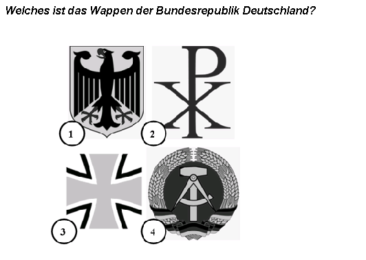
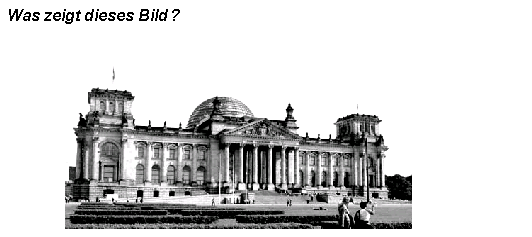
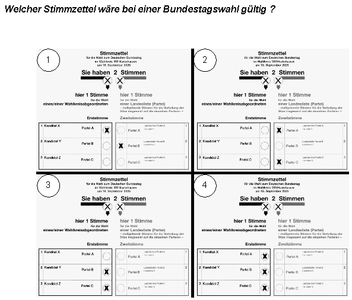
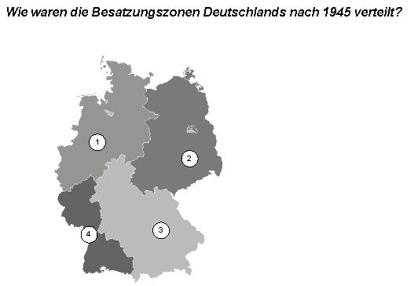
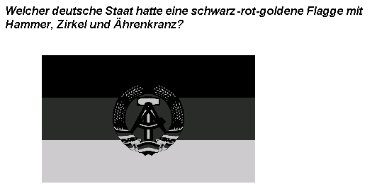
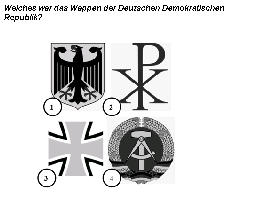
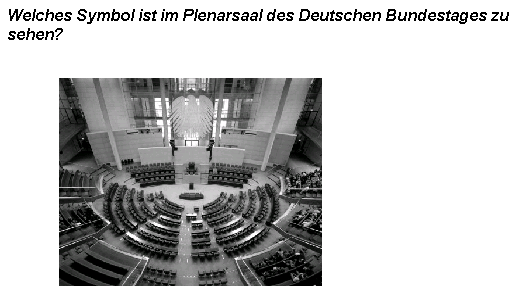
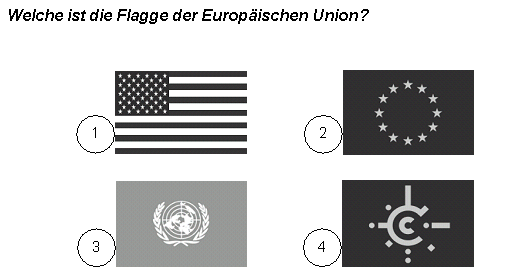
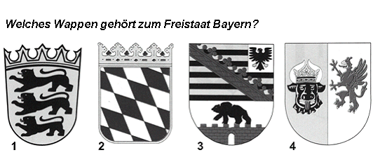
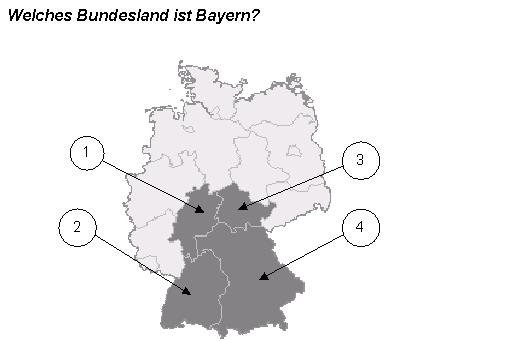

# Einbürgerungstest - all 310 questions with answers (Bayern)

300 general questions + 10 Bayern questions. The real test draws 30 general + 3 Bayern questions; 17 correct out of 33 is a pass.

- Question text: official BAMF catalog PDF, Stand 07.05.2025 (`official/`).
- Options and correct answer: official BAMF Online-Testcenter (oet.bamf.de), scraped 2026-10-02.
- The correct answer is **bold** and marked with ✅. Picture questions show the official image.

Generated by `scripts/build_dataset.py` - do not edit by hand.

## Teil I - Allgemeine Fragen (1-300)

### 1. In Deutschland dürfen Menschen offen etwas gegen die Regierung sagen, weil …

- A) hier Religionsfreiheit gilt.
- B) die Menschen Steuern zahlen.
- C) die Menschen das Wahlrecht haben.
- ✅ **D) hier Meinungsfreiheit gilt.**

### 2. In Deutschland können Eltern bis zum 14. Lebensjahr ihres Kindes entscheiden, ob es in der Schule am …

- A) Geschichtsunterricht teilnimmt.
- ✅ **B) Religionsunterricht teilnimmt.**
- C) Politikunterricht teilnimmt.
- D) Sprachunterricht teilnimmt.

### 3. Deutschland ist ein Rechtsstaat. Was ist damit gemeint?

- ✅ **A) Alle Einwohnerinnen/Einwohner und der Staat müssen sich an die Gesetze halten.**
- B) Der Staat muss sich nicht an die Gesetze halten.
- C) Nur Deutsche müssen die Gesetze befolgen.
- D) Die Gerichte machen die Gesetze.

### 4. Welches Recht gehört zu den Grundrechten in Deutschland?

- A) Waffenbesitz
- B) Faustrecht
- ✅ **C) Meinungsfreiheit**
- D) Selbstjustiz

### 5. Wahlen in Deutschland sind frei. Was bedeutet das?

- A) Man darf Geld annehmen, wenn man dafür eine bestimmte Kandidatin/einen bestimmten Kandidaten wählt.
- B) Nur Personen, die noch nie im Gefängnis waren, dürfen wählen.
- ✅ **C) Die Wählerin/der Wähler darf bei der Wahl weder beeinflusst noch zu einer bestimmten Stimmabgabe gezwungen werden und keine Nachteile durch die Wahl haben.**
- D) Alle wahlberechtigten Personen müssen wählen.

### 6. Wie heißt die deutsche Verfassung?

- A) Volksgesetz
- B) Bundesgesetz
- C) Deutsches Gesetz
- ✅ **D) Grundgesetz**

### 7. Welches Recht gehört zu den Grundrechten, die nach der deutschen Verfassung garantiert werden? Das Recht auf …

- ✅ **A) Glaubens- und Gewissensfreiheit**
- B) Unterhaltung
- C) Arbeit
- D) Wohnung

### 8. Was steht nicht im Grundgesetz von Deutschland?

- A) Die Würde des Menschen ist unantastbar.
- ✅ **B) Alle sollen gleich viel Geld haben.**
- C) Jeder Mensch darf seine Meinung sagen.
- D) Alle sind vor dem Gesetz gleich.

### 9. Welches Grundrecht gilt in Deutschland nur für Ausländerinnen/Ausländer? Das Grundrecht auf …

- A) Schutz der Familie
- B) Menschenwürde
- ✅ **C) Asyl**
- D) Meinungsfreiheit

### 10. Was ist mit dem deutschen Grundgesetz vereinbar?

- A) die Prügelstrafe
- B) die Folter
- C) die Todesstrafe
- ✅ **D) die Geldstrafe**

### 11. Wie wird die Verfassung der Bundesrepublik Deutschland genannt?

- ✅ **A) Grundgesetz**
- B) Bundesverfassung
- C) Gesetzbuch
- D) Verfassungsvertrag

### 12. Eine Partei im Deutschen Bundestag will die Pressefreiheit abschaffen. Ist das möglich?

- A) Ja, wenn mehr als die Hälfte der Abgeordneten im Bundestag dafür sind.
- B) Ja, aber dazu müssen zwei Drittel der Abgeordneten im Bundestag dafür sein.
- ✅ **C) Nein, denn die Pressefreiheit ist ein Grundrecht. Sie kann nicht abgeschafft werden.**
- D) Nein, denn nur der Bundesrat kann die Pressefreiheit abschaffen.

### 13. Im Parlament steht der Begriff "Opposition" für …

- A) die regierenden Parteien.
- B) die Fraktion mit den meisten Abgeordneten.
- C) alle Parteien, die bei der letzten Wahl die 5%-Hürde erreichen konnten.
- ✅ **D) alle Abgeordneten, die nicht zu der Regierungspartei/den Regierungsparteien gehören.**

### 14. Meinungsfreiheit in Deutschland heißt, dass ich …

- A) Passanten auf der Straße beschimpfen darf.
- ✅ **B) meine Meinung im Internet äußern kann.**
- C) Nazi-, Hamas- oder Islamischer Staat-Symbole öffentlich tragen darf.
- D) meine Meinung nur dann äußern darf, solange ich der Regierung nicht widerspreche.

### 15. Was verbietet das deutsche Grundgesetz?

- A) Militärdienst
- ✅ **B) Zwangsarbeit**
- C) freie Berufswahl
- D) Arbeit im Ausland

### 16. Wann ist die Meinungsfreiheit in Deutschland eingeschränkt?

- ✅ **A) bei der öffentlichen Verbreitung falscher Behauptungen über einzelne Personen**
- B) bei Meinungsäußerungen über die Bundesregierung
- C) bei Diskussionen über Religionen
- D) bei Kritik am Staat

### 17. Die deutschen Gesetze verbieten …

- A) Meinungsfreiheit der Einwohnerinnen und Einwohner.
- B) Petitionen der Bürgerinnen und Bürger.
- C) Versammlungsfreiheit der Einwohnerinnen und Einwohner.
- ✅ **D) Ungleichbehandlung der Bürgerinnen und Bürger durch den Staat.**

### 18. Welches Grundrecht ist in Artikel 1 des Grundgesetzes der Bundesrepublik Deutschland garantiert?

- ✅ **A) die Unantastbarkeit der Menschenwürde**
- B) das Recht auf Leben
- C) Religionsfreiheit
- D) Meinungsfreiheit

### 19. Was versteht man unter dem Recht der "Freizügigkeit" in Deutschland?

- ✅ **A) Man darf sich seinen Wohnort selbst aussuchen.**
- B) Man kann seinen Beruf wechseln.
- C) Man darf sich für eine andere Religion entscheiden.
- D) Man darf sich in der Öffentlichkeit nur leicht bekleidet bewegen.

### 20. Eine Partei in Deutschland verfolgt das Ziel, eine Diktatur zu errichten. Sie ist dann …

- A) tolerant.
- B) rechtsstaatlich orientiert.
- C) gesetzestreu.
- ✅ **D) verfassungswidrig.**

### 21. Welches ist das Wappen der Bundesrepublik Deutschland?

- ✅ **A) Bild 1**
- B) Bild 2
- C) Bild 3
- D) Bild 4

### 22. Was für eine Staatsform hat Deutschland?

- A) Monarchie
- B) Diktatur
- ✅ **C) Republik**
- D) Fürstentum

### 23. In Deutschland sind die meisten Erwerbstätigen …

- A) in kleinen Familienunternehmen beschäftigt.
- B) ehrenamtlich für ein Bundesland tätig.
- C) selbstständig mit einer eigenen Firma tätig.
- ✅ **D) bei einer Firma oder Behörde beschäftigt.**

### 24. Wie viele Bundesländer hat die Bundesrepublik Deutschland?

- A) 14
- B) 15
- ✅ **C) 16**
- D) 17

### 25. Was ist kein Bundesland der Bundesrepublik Deutschland?

- ✅ **A) Elsass-Lothringen**
- B) Nordrhein-Westfalen
- C) Mecklenburg-Vorpommern
- D) Sachsen-Anhalt

### 26. Deutschland ist …

- A) eine kommunistische Republik.
- ✅ **B) ein demokratischer und sozialer Bundesstaat.**
- C) eine kapitalistische und soziale Monarchie.
- D) ein sozialer und sozialistischer Bundesstaat.

### 27. Deutschland ist …

- A) ein sozialistischer Staat.
- ✅ **B) ein Bundesstaat.**
- C) eine Diktatur.
- D) eine Monarchie.

### 28. Wer wählt in Deutschland die Abgeordneten zum Bundestag?

- A) das Militär
- B) die Wirtschaft
- ✅ **C) das wahlberechtigte Volk**
- D) die Verwaltung

### 29. Welches Tier ist das Wappentier der Bundesrepublik Deutschland?

- A) Löwe
- ✅ **B) Adler**
- C) Bär
- D) Pferd

### 30. Was ist kein Merkmal unserer Demokratie?

- A) regelmäßige Wahlen
- ✅ **B) Pressezensur**
- C) Meinungsfreiheit
- D) verschiedene Parteien

### 31. Die Zusammenarbeit von Parteien zur Bildung einer Regierung nennt man in Deutschland …

- A) Einheit.
- ✅ **B) Koalition.**
- C) Ministerium.
- D) Fraktion.

### 32. Was ist keine staatliche Gewalt in Deutschland?

- A) Gesetzgebung
- B) Regierung
- ✅ **C) Presse**
- D) Rechtsprechung

### 33. Welche Aussage ist richtig? In Deutschland …

- ✅ **A) sind Staat und Religionsgemeinschaften voneinander getrennt.**
- B) bilden die Religionsgemeinschaften den Staat.
- C) ist der Staat abhängig von den Religionsgemeinschaften.
- D) bilden Staat und Religionsgemeinschaften eine Einheit.

### 34. Was ist Deutschland nicht?

- A) eine Demokratie
- B) ein Rechtsstaat
- ✅ **C) eine Monarchie**
- D) ein Sozialstaat

### 35. Womit finanziert der deutsche Staat die Sozialversicherung?

- A) Kirchensteuer
- ✅ **B) Sozialabgaben**
- C) Spendengeldern
- D) Vereinsbeiträgen

### 36. Welche Maßnahme schafft in Deutschland soziale Sicherheit?

- ✅ **A) die Krankenversicherung**
- B) die Autoversicherung
- C) die Gebäudeversicherung
- D) die Haftpflichtversicherung

### 37. Wie werden die Regierungschefinnen/Regierungschefs der meisten Bundesländer in Deutschland genannt?

- A) Erste Ministerin/Erster Minister
- B) Premierministerin/Premierminister
- C) Senatorin/Senator
- ✅ **D) Ministerpräsidentin/Ministerpräsident**

### 38. Die Bundesrepublik Deutschland ist ein demokratischer und sozialer …

- A) Staatenverbund.
- ✅ **B) Bundesstaat.**
- C) Staatenbund.
- D) Zentralstaat.

### 39. Was hat jedes deutsche Bundesland?

- A) eine eigene Außenministerin/einen eigenen Außenminister
- B) eine eigene Währung
- C) eine eigene Armee
- ✅ **D) eine eigene Regierung**

### 40. Mit welchen Worten beginnt die deutsche Nationalhymne?

- A) Völker, hört die Signale …
- ✅ **B) Einigkeit und Recht und Freiheit …**
- C) Freude schöner Götterfunken …
- D) Deutschland einig Vaterland …

### 41. Warum gibt es in einer Demokratie mehr als eine Partei?

- ✅ **A) weil dadurch die unterschiedlichen Meinungen der Bürgerinnen und Bürger vertreten werden**
- B) damit Bestechung in der Politik begrenzt wird
- C) um politische Demonstrationen zu verhindern
- D) um wirtschaftlichen Wettbewerb anzuregen

### 42. Wer beschließt in Deutschland ein neues Gesetz?

- A) die Regierung
- ✅ **B) das Parlament**
- C) die Gerichte
- D) die Polizei

### 43. Wann kann in Deutschland eine Partei verboten werden?

- A) wenn ihr Wahlkampf zu teuer ist
- ✅ **B) wenn sie gegen die Verfassung kämpft**
- C) wenn sie Kritik am Staatsoberhaupt äußert
- D) wenn ihr Programm eine neue Richtung vorschlägt

### 44. Wen kann man als Bürgerin/Bürger in Deutschland nicht direkt wählen?

- A) Abgeordnete des EU-Parlaments
- ✅ **B) Die Bundespräsidentin/den Bundespräsidenten**
- C) Landtagsabgeordnete
- D) Bundestagsabgeordnete

### 45. Zu welcher Versicherung gehört die Pflegeversicherung?

- ✅ **A) Sozialversicherung**
- B) Unfallversicherung
- C) Hausratsversicherung
- D) Haftpflicht- und Feuerversicherung

### 46. Der deutsche Staat hat viele Aufgaben. Welche Aufgabe gehört dazu?

- ✅ **A) Er baut Straßen und Schulen.**
- B) Er verkauft Lebensmittel und Kleidung.
- C) Er versorgt alle Einwohnerinnen und Einwohner kostenlos mit Zeitungen.
- D) Er produziert Autos und Busse.

### 47. Der deutsche Staat hat viele Aufgaben. Welche Aufgabe gehört nicht dazu?

- ✅ **A) Er bezahlt für alle Staatsangehörigen Urlaubsreisen.**
- B) Er zahlt Kindergeld.
- C) Er unterstützt Museen.
- D) Er fördert Sportlerinnen und Sportler.

### 48. Welches Organ gehört nicht zu den Verfassungsorganen Deutschlands?

- A) der Bundesrat
- B) die Bundespräsidentin/der Bundespräsident
- ✅ **C) die Bürgerversammlung**
- D) die Regierung

### 49. Wer bestimmt in Deutschland die Schulpolitik?

- A) die Lehrer und Lehrerinnen
- ✅ **B) die Bundesländer**
- C) das Familienministerium
- D) die Universitäten

### 50. Die Wirtschaftsform in Deutschland nennt man …

- A) freie Zentralwirtschaft.
- ✅ **B) soziale Marktwirtschaft.**
- C) gelenkte Zentralwirtschaft.
- D) Planwirtschaft.

### 51. Zu einem demokratischen Rechtsstaat gehört es nicht, dass …

- A) Menschen sich kritisch über die Regierung äußern können.
- B) Bürger friedlich demonstrieren gehen dürfen.
- ✅ **C) Menschen von einer Privatpolizei ohne Grund verhaftet werden.**
- D) jemand ein Verbrechen begeht und deshalb verhaftet wird.

### 52. Was bedeutet "Volkssouveränität"? Alle Staatsgewalt geht vom ...

- ✅ **A) Volke aus.**
- B) Bundestag aus.
- C) preußischen König aus.
- D) Bundesverfassungsgericht aus.

### 53. Was bedeutet "Rechtsstaat" in Deutschland?

- A) Der Staat hat Recht.
- B) Es gibt nur rechte Parteien.
- C) Die Bürgerinnen und Bürger entscheiden über Gesetze.
- ✅ **D) Der Staat muss die Gesetze einhalten.**

### 54. Was ist keine staatliche Gewalt in Deutschland?

- A) Legislative
- B) Judikative
- C) Exekutive
- ✅ **D) Direktive**

### 55. Was zeigt dieses Bild? © Deutscher Bundestag/Achim Melde

- ✅ **A) den Bundestagssitz in Berlin**
- B) das Bundesverfassungsgericht in Karlsruhe
- C) das Bundesratsgebäude in Berlin
- D) das Bundeskanzleramt in Berlin

### 56. Welches Amt gehört in Deutschland zur Gemeindeverwaltung?

- A) Pfarramt
- ✅ **B) Ordnungsamt**
- C) Finanzamt
- D) Auswärtiges Amt

### 57. Wer wird meistens zur Präsidentin/zum Präsidenten des Deutschen Bundestages gewählt?

- A) die/der älteste Abgeordnete im Parlament
- B) die Ministerpräsidentin/der Ministerpräsident des größten Bundeslandes
- C) eine ehemalige Bundeskanzlerin/ein ehemaliger Bundeskanzler
- ✅ **D) eine Abgeordnete/ein Abgeordneter der stärksten Fraktion**

### 58. Wer ernennt in Deutschland die Ministerinnen/die Minister der Bundesregierung?

- A) die Präsidentin/der Präsident des Bundesverfassungsgerichtes
- ✅ **B) die Bundespräsidentin/der Bundespräsident**
- C) die Bundesratspräsidentin/der Bundesratspräsident
- D) die Bundestagspräsidentin/der Bundestagspräsident

### 59. Vor wie vielen Jahren gab es erstmals eine jüdische Gemeinde auf dem Gebiet des heutigen Deutschlands?

- A) vor etwa 300 Jahren
- B) vor etwa 700 Jahren
- C) vor etwa 1150 Jahren
- ✅ **D) vor etwa 1700 Jahren**

### 60. In Deutschland gehören der Bundestag und der Bundesrat zur …

- A) Exekutive.
- ✅ **B) Legislative.**
- C) Direktive.
- D) Judikative.

### 61. Was bedeutet "Volkssouveränität"?

- A) Die Königin/der König herrscht über das Volk.
- B) Das Bundesverfassungsgericht steht über der Verfassung.
- C) Die Interessenverbände üben die Souveränität zusammen mit der Regierung aus.
- ✅ **D) Die Staatsgewalt geht vom Volke aus.**

### 62. Wenn das Parlament eines deutschen Bundeslandes gewählt wird, nennt man das …

- A) Kommunalwahl
- ✅ **B) Landtagswahl**
- C) Europawahl
- D) Bundestagswahl

### 63. Was gehört in Deutschland nicht zur Exekutive?

- A) die Polizei
- ✅ **B) die Gerichte**
- C) das Finanzamt
- D) die Ministerien

### 64. Die Bundesrepublik Deutschland ist heute gegliedert in …

- A) vier Besatzungszonen.
- B) einen Oststaat und einen Weststaat.
- C) 16 Kantone.
- ✅ **D) Bund, Länder und Kommunen.**

### 65. Es gehört nicht zu den Aufgaben des Deutschen Bundestages, …

- A) Gesetze zu entwerfen.
- B) die Bundesregierung zu kontrollieren.
- C) die Bundeskanzlerin/den Bundeskanzler zu wählen.
- ✅ **D) das Bundeskabinett zu bilden.**

### 66. Welche Städte haben die größten jüdischen Gemeinden in Deutschland?

- ✅ **A) Berlin und München**
- B) Hamburg und Essen
- C) Nürnberg und Stuttgart
- D) Worms und Speyer

### 67. Was ist in Deutschland vor allem eine Aufgabe der Bundesländer?

- A) Verteidigungspolitik
- B) Außenpolitik
- C) Wirtschaftspolitik
- ✅ **D) Schulpolitik**

### 68. Warum kontrolliert der Staat in Deutschland das Schulwesen?

- A) weil es in Deutschland nur staatliche Schulen gibt
- B) weil alle Schülerinnen und Schüler einen Schulabschluss haben müssen
- C) weil es in den Bundesländern verschiedene Schulen gibt
- ✅ **D) weil es nach dem Grundgesetz seine Aufgabe ist**

### 69. Die Bundesrepublik Deutschland hat einen dreistufigen Verwaltungsaufbau. Wie heißt die unterste politische Stufe?

- A) Stadträte
- B) Landräte
- ✅ **C) Gemeinden**
- D) Bezirksämter

### 70. Der deutsche Bundespräsident Gustav Heinemann gibt Helmut Schmidt 1974 die Ernennungsurkunde zum deutschen Bundeskanzler. Was gehört zu den Aufgaben der deutschen Bundespräsidentin/des deutschen Bundespräsidenten? © Bundesregierung/Engelbert Reineke

- A) Sie/Er führt die Regierungsgeschäfte.
- B) Sie/Er kontrolliert die Regierungspartei.
- C) Sie/Er wählt die Ministerinnen/Minister aus.
- ✅ **D) Sie/Er schlägt die Kanzlerin/den Kanzler zur Wahl vor.**

### 71. Wo hält sich die deutsche Bundeskanzlerin/der deutsche Bundeskanzler am häufigsten auf? Am häufigsten ist sie/er …

- A) in Bonn, weil sich dort das Bundeskanzleramt und der Bundestag befinden.
- B) auf Schloss Meseberg, dem Gästehaus der Bundesregierung, um Staatsgäste zu empfangen.
- C) auf Schloss Bellevue, dem Amtssitz der Bundespräsidentin/des Bundespräsidenten, um Staatsgäste zu empfangen.
- ✅ **D) in Berlin, weil sich dort das Bundeskanzleramt und der Bundestag befinden.**

### 72. Wie heißt die jetzige Bundeskanzlerin/der jetzige Bundeskanzler von Deutschland?

- A) Gerhard Schröder
- B) Angela Merkel
- C) Ursula von der Leyen
- ✅ **D) Friedrich Merz**

### 73. Die beiden größten Fraktionen im Deutschen Bundestag heißen zurzeit …

- ✅ **A) CDU/CSU und AfD.**
- B) Die Linke und Bündnis 90/Die Grünen.
- C) Bündnis 90/Die Grünen und SPD.
- D) Die Linke und CDU/CSU.

### 74. Wie heißt das Parlament für ganz Deutschland?

- A) Bundesversammlung
- B) Volkskammer
- ✅ **C) Bundestag**
- D) Bundesgerichtshof

### 75. Wie heißt Deutschlands heutiges Staatsoberhaupt?

- ✅ **A) Frank-Walter Steinmeier**
- B) Bärbel Bas
- C) Bodo Ramelow
- D) Joachim Gauck

### 76. Was bedeutet die Abkürzung CDU in Deutschland?

- A) Christliche Deutsche Union
- B) Club Deutscher Unternehmer
- C) Christlicher Deutscher Umweltschutz
- ✅ **D) Christlich Demokratische Union**

### 77. Was ist die Bundeswehr?

- A) die deutsche Polizei
- B) ein deutscher Hafen
- C) eine deutsche Bürgerinitiative
- ✅ **D) die deutsche Armee**

### 78. Was bedeutet die Abkürzung SPD?

- A) Sozialistische Partei Deutschlands
- B) Sozialpolitische Partei Deutschlands
- ✅ **C) Sozialdemokratische Partei Deutschlands**
- D) Sozialgerechte Partei Deutschlands

### 79. Was bedeutet die Abkürzung FDP in Deutschland?

- A) Friedliche Demonstrative Partei
- B) Freie Deutschland Partei
- C) Führende Demokratische Partei
- ✅ **D) Freie Demokratische Partei**

### 80. Welches Gericht in Deutschland ist zuständig für die Auslegung des Grundgesetzes?

- A) Oberlandesgericht
- B) Amtsgericht
- ✅ **C) Bundesverfassungsgericht**
- D) Verwaltungsgericht

### 81. Wer wählt die Bundeskanzlerin/den Bundeskanzler in Deutschland?

- A) der Bundesrat
- B) die Bundesversammlung
- C) das Volk
- ✅ **D) der Bundestag**

### 82. Wer leitet das deutsche Bundeskabinett?

- A) die Bundestagspräsidentin/der Bundestagspräsident
- B) die Bundespräsidentin/der Bundespräsident
- C) die Bundesratspräsidentin/der Bundesratspräsident
- ✅ **D) die Bundeskanzlerin/der Bundeskanzler**

### 83. Wer wählt die deutsche Bundeskanzlerin/den deutschen Bundeskanzler?

- A) das Volk
- B) die Bundesversammlung
- ✅ **C) der Bundestag**
- D) die Bundesregierung

### 84. Welche Hauptaufgabe hat die deutsche Bundespräsidentin/der deutsche Bundespräsident? Sie/Er …

- A) regiert das Land.
- B) entwirft die Gesetze.
- ✅ **C) repräsentiert das Land.**
- D) überwacht die Einhaltung der Gesetze.

### 85. Wer bildet den deutschen Bundesrat?

- A) die Abgeordneten des Bundestages
- B) die Ministerinnen und Minister der Bundesregierung
- ✅ **C) die Regierungsvertreter der Bundesländer**
- D) die Parteimitglieder

### 86. Wer wählt in Deutschland die Bundespräsidentin/den Bundespräsidenten?

- ✅ **A) die Bundesversammlung**
- B) der Bundesrat
- C) das Bundesparlament
- D) das Bundesverfassungsgericht

### 87. Wer ist das Staatsoberhaupt der Bundesrepublik Deutschland?

- A) die Bundeskanzlerin/der Bundeskanzler
- ✅ **B) die Bundespräsidentin/der Bundespräsident**
- C) die Bundesratspräsidentin/der Bundesratspräsident
- D) die Bundestagspräsidentin/der Bundestagspräsident

### 88. Die parlamentarische Opposition im Deutschen Bundestag …

- ✅ **A) kontrolliert die Regierung.**
- B) entscheidet, wer Bundesministerin/Bundesminister wird.
- C) bestimmt, wer im Bundesrat sitzt.
- D) schlägt die Regierungschefinnen/Regierungschefs der Länder vor.

### 89. Wie nennt man in Deutschland die Vereinigung von Abgeordneten einer Partei im Parlament?

- A) Verband
- B) Ältestenrat
- ✅ **C) Fraktion**
- D) Opposition

### 90. Die deutschen Bundesländer wirken an der Gesetzgebung des Bundes mit durch …

- ✅ **A) den Bundesrat.**
- B) die Bundesversammlung.
- C) den Bundestag.
- D) die Bundesregierung.

### 91. In Deutschland kann ein Regierungswechsel in einem Bundesland Auswirkungen auf die Bundespolitik haben. Das Regieren wird …

- A) schwieriger, wenn sich dadurch die Mehrheit im Bundestag ändert.
- B) leichter, wenn dadurch neue Parteien in den Bundesrat kommen.
- ✅ **C) schwieriger, wenn dadurch die Mehrheit im Bundesrat verändert wird.**
- D) leichter, wenn es sich um ein reiches Bundesland handelt.

### 92. Was bedeutet die Abkürzung CSU in Deutschland?

- A) Christlich Sichere Union
- B) Christlich Süddeutsche Union
- C) Christlich Sozialer Unternehmerverband
- ✅ **D) Christlich Soziale Union**

### 93. Je mehr "Zweitstimmen" eine Partei bei einer Bundestagswahl bekommt, desto …

- A) weniger Erststimmen kann sie haben.
- B) mehr Direktkandidaten der Partei ziehen ins Parlament ein.
- C) größer ist das Risiko, eine Koalition bilden zu müssen.
- ✅ **D) mehr Sitze erhält die Partei im Parlament.**

### 94. Ab welchem Alter darf man in Deutschland an der Wahl zum Deutschen Bundestag teilnehmen?

- A) 16
- ✅ **B) 18**
- C) 21
- D) 23

### 95. Was gilt für die meisten Kinder in Deutschland?

- A) Wahlpflicht
- ✅ **B) Schulpflicht**
- C) Schweigepflicht
- D) Religionspflicht

### 96. Wie kann jemand, der den Holocaust leugnet, bestraft werden?

- A) Kürzung sozialer Leistungen
- B) bis zu 100 Sozialstunden
- C) gar nicht, Holocaustleugnung ist erlaubt
- ✅ **D) mit Freiheitsstrafe bis zu fünf Jahren oder mit Geldstrafe**

### 97. Was bezahlt man in Deutschland automatisch, wenn man fest angestellt ist?

- ✅ **A) Sozialversicherung**
- B) Sozialhilfe
- C) Kindergeld
- D) Wohngeld

### 98. Wenn Abgeordnete im Deutschen Bundestag ihre Fraktion wechseln, …

- A) dürfen sie nicht mehr an den Sitzungen des Parlaments teilnehmen.
- ✅ **B) kann die Regierung ihre Mehrheit verlieren.**
- C) muss die Bundespräsidentin/der Bundespräsident zuvor ihr/sein Einverständnis geben.
- D) dürfen die Wählerinnen/Wähler dieser Abgeordneten noch einmal wählen.

### 99. Wer bezahlt in Deutschland die Sozialversicherungen?

- ✅ **A) Arbeitgeberinnen/Arbeitgeber und Arbeitnehmerinnen/Arbeitnehmer**
- B) nur Arbeitnehmerinnen/Arbeitnehmer
- C) alle Staatsangehörigen
- D) nur Arbeitgeberinnen/Arbeitgeber

### 100. Was gehört nicht zur gesetzlichen Sozialversicherung?

- ✅ **A) die Lebensversicherung**
- B) die gesetzliche Rentenversicherung
- C) die Arbeitslosenversicherung
- D) die Pflegeversicherung

### 101. Gewerkschaften sind Interessenverbände der …

- A) Jugendlichen.
- ✅ **B) Arbeitnehmerinnen und Arbeitnehmer.**
- C) Rentnerinnen und Rentner.
- D) Arbeitgeberinnen und Arbeitgeber.

### 102. Womit kann man in der Bundesrepublik Deutschland geehrt werden, wenn man auf politischem, wirtschaftlichem, kulturellem, geistigem oder sozialem Gebiet eine besondere Leistung erbracht hat? Mit dem …

- ✅ **A) Bundesverdienstkreuz**
- B) Bundesadler
- C) Vaterländischen Verdienstorden
- D) Ehrentitel "Held der Deutschen Demokratischen Republik"

### 103. Was wird in Deutschland als "Ampelkoalition" bezeichnet? Die Zusammenarbeit …

- A) der Bundestagsfraktionen von CDU und CSU
- ✅ **B) von SPD, FDP und Bündnis 90/Die Grünen in einer Regierung**
- C) von CSU, Die LINKE und Bündnis 90/Die Grünen in einer Regierung
- D) der Bundestagsfraktionen von CDU und SPD

### 104. Eine Frau in Deutschland verliert ihre Arbeit. Was darf nicht der Grund für diese Entlassung sein?

- A) Die Frau ist lange krank und arbeitsunfähig.
- B) Die Frau kam oft zu spät zur Arbeit.
- C) Die Frau erledigt private Sachen während der Arbeitszeit.
- ✅ **D) Die Frau bekommt ein Kind und ihr Chef weiß das.**

### 105. Was ist eine Aufgabe von Wahlhelferinnen/Wahlhelfern in Deutschland?

- A) Sie helfen alten Menschen bei der Stimmabgabe in der Wahlkabine.
- B) Sie schreiben die Wahlbenachrichtigungen vor der Wahl.
- C) Sie geben Zwischenergebnisse an die Medien weiter.
- ✅ **D) Sie zählen die Stimmen nach dem Ende der Wahl.**

### 106. In Deutschland helfen ehrenamtliche Wahlhelferinnen und Wahlhelfer bei den Wahlen. Was ist eine Aufgabe von Wahlhelferinnen/Wahlhelfern?

- A) Sie helfen Kindern und alten Menschen beim Wählen.
- B) Sie schreiben Karten und Briefe mit der Angabe des Wahllokals.
- C) Sie geben Zwischenergebnisse an Journalisten weiter.
- ✅ **D) Sie zählen die Stimmen nach dem Ende der Wahl.**

### 107. Für wie viele Jahre wird der Bundestag in Deutschland gewählt?

- A) 2 Jahre
- ✅ **B) 4 Jahre**
- C) 6 Jahre
- D) 8 Jahre

### 108. Bei einer Bundestagswahl in Deutschland darf jede/jeder wählen, die/der …

- A) in der Bundesrepublik Deutschland wohnt und wählen möchte.
- ✅ **B) Bürgerin/Bürger der Bundesrepublik Deutschland ist und mindestens 18 Jahre alt ist.**
- C) seit mindestens 3 Jahren in der Bundesrepublik Deutschland lebt.
- D) Bürgerin/Bürger der Bundesrepublik Deutschland ist und mindestens 21 Jahre alt ist.

### 109. Wie oft gibt es normalerweise Bundestagswahlen in Deutschland?

- A) alle drei Jahre
- ✅ **B) alle vier Jahre**
- C) alle fünf Jahre
- D) alle sechs Jahre

### 110. Für wie viele Jahre wird der Bundestag in Deutschland gewählt?

- A) 2 Jahre
- B) 3 Jahre
- ✅ **C) 4 Jahre**
- D) 5 Jahre

### 111. Welche Handlungen mit Bezug auf den Staat Israel sind in Deutschland verboten?

- A) die Politik Israels öffentlich kritisieren
- B) das Aufhängen einer israelischen Flagge auf dem Privatgrundstück
- C) eine Diskussion über die Politik Israels
- ✅ **D) der öffentliche Aufruf zur Vernichtung Israels**

### 112. Die Wahlen in Deutschland sind …

- A) speziell.
- ✅ **B) geheim.**
- C) berufsbezogen.
- D) geschlechtsabhängig.

### 113. Wahlen in Deutschland gewinnt die Partei, die …

- ✅ **A) die meisten Stimmen bekommt.**
- B) die meisten Männer mehrheitlich gewählt haben.
- C) die meisten Stimmen bei den Arbeiterinnen/Arbeitern bekommen hat.
- D) die meisten Erststimmen für ihre Kanzlerkandidatin/ihren Kanzlerkandidaten erhalten hat.

### 114. An demokratischen Wahlen in Deutschland teilzunehmen ist …

- A) eine Pflicht.
- ✅ **B) ein Recht.**
- C) ein Zwang.
- D) eine Last.

### 115. Was bedeutet "aktives Wahlrecht" in Deutschland?

- A) Man kann gewählt werden.
- B) Man muss wählen gehen.
- ✅ **C) Man kann wählen.**
- D) Man muss zur Auszählung der Stimmen gehen.

### 116. Wenn Sie bei einer Bundestagswahl in Deutschland wählen dürfen, heißt das …

- A) aktive Wahlkampagne.
- B) aktives Wahlverfahren.
- C) aktiver Wahlkampf.
- ✅ **D) aktives Wahlrecht.**

### 117. Wie viel Prozent der Zweitstimmen müssen Parteien mindestens bekommen, um in den Deutschen Bundestag gewählt zu werden?

- A) 3%
- B) 4%
- ✅ **C) 5%**
- D) 6%

### 118. Wer darf bei den rund 40 jüdischen Makkabi-Sportvereinen Mitglied werden?

- A) nur Deutsche
- B) nur Israelis
- C) nur religiöse Menschen
- ✅ **D) alle Menschen**

### 119. Wahlen in Deutschland sind frei. Was bedeutet das?

- A) Alle verurteilten Straftäterinnen/Straftäter dürfen nicht wählen.
- B) Wenn ich wählen gehen möchte, muss meine Arbeitgeberin/mein Arbeitgeber mir frei geben.
- ✅ **C) Jede Person kann ohne Zwang entscheiden, ob sie wählen möchte und wen sie wählen möchte.**
- D) Ich kann frei entscheiden, wo ich wählen gehen möchte.

### 120. Das Wahlsystem in Deutschland ist ein …

- A) Zensuswahlrecht.
- B) Dreiklassenwahlrecht.
- ✅ **C) Mehrheits- und Verhältniswahlrecht.**
- D) allgemeines Männerwahlrecht.

### 121. Eine Partei möchte in den Deutschen Bundestag. Sie muss aber einen Mindestanteil an Wählerstimmen haben. Das heißt …

- ✅ **A) 5%-Hürde.**
- B) Zulassungsgrenze.
- C) Basiswert.
- D) Richtlinie.

### 122. Welchem Grundsatz unterliegen Wahlen in Deutschland? Wahlen in Deutschland sind …

- ✅ **A) frei, gleich, geheim.**
- B) offen, sicher, frei.
- C) geschlossen, gleich, sicher.
- D) sicher, offen, freiwillig.

### 123. Was ist in Deutschland die "5%-Hürde"?

- A) Abstimmungsregelung im Bundestag für kleine Parteien
- B) Anwesenheitskontrolle im Bundestag für Abstimmungen
- ✅ **C) Mindestanteil an Wählerstimmen, um ins Parlament zu kommen**
- D) Anwesenheitskontrolle im Bundesrat für Abstimmungen

### 124. Die Bundestagswahl in Deutschland ist die Wahl …

- A) der Bundeskanzlerin/des Bundeskanzlers.
- B) der Parlamente der Länder.
- ✅ **C) des Parlaments für Deutschland.**
- D) der Bundespräsidentin/des Bundespräsidenten.

### 125. In einer Demokratie ist eine Funktion von regelmäßigen Wahlen, …

- A) die Bürgerinnen und Bürger zu zwingen, ihre Stimme abzugeben.
- ✅ **B) nach dem Willen der Wählermehrheit den Wechsel der Regierung zu ermöglichen.**
- C) im Land bestehende Gesetze beizubehalten.
- D) den Armen mehr Macht zu geben.

### 126. Was bekommen wahlberechtigte Bürgerinnen und Bürger in Deutschland vor einer Wahl?

- ✅ **A) eine Wahlbenachrichtigung von der Gemeinde**
- B) eine Wahlerlaubnis von der Bundespräsidentin/von dem Bundespräsidenten
- C) eine Benachrichtigung von der Bundesversammlung
- D) eine Benachrichtigung vom Pfarramt

### 127. Warum gibt es die 5%-Hürde im Wahlgesetz der Bundesrepublik Deutschland? Es gibt sie, weil …

- A) die Programme von vielen kleinen Parteien viele Gemeinsamkeiten haben.
- B) die Bürgerinnen und Bürger bei vielen kleinen Parteien die Orientierung verlieren können.
- ✅ **C) viele kleine Parteien die Regierungsbildung erschweren.**
- D) die kleinen Parteien nicht so viel Geld haben, um die Politikerinnen und Politiker zu bezahlen.

### 128. Parlamentsmitglieder, die von den Bürgerinnen und Bürgern gewählt werden, nennt man …

- ✅ **A) Abgeordnete.**
- B) Kanzlerinnen/Kanzler.
- C) Botschafterinnen/Botschafter.
- D) Ministerpräsidentinnen/Ministerpräsidenten.

### 129. Vom Volk gewählt wird in Deutschland …

- A) die Bundeskanzlerin/der Bundeskanzler.
- B) die Ministerpräsidentin/der Ministerpräsident eines Bundeslandes.
- ✅ **C) der Bundestag.**
- D) die Bundespräsidentin/der Bundespräsident.

### 130. Welcher Stimmzettel wäre bei einer Bundestagswahl gültig? In Anlehnung an Bundeswahlordnung (BWO), Anlage 26

- ✅ **A) 1**
- B) 2
- C) 3
- D) 4

### 131. In Deutschland ist eine Bürgermeisterin/ein Bürgermeister …

- A) die Leiterin/der Leiter einer Schule.
- B) die Chefin/der Chef einer Bank.
- ✅ **C) das Oberhaupt einer Gemeinde.**
- D) die/der Vorsitzende einer Partei.

### 132. Viele Menschen in Deutschland arbeiten in ihrer Freizeit ehrenamtlich. Was bedeutet das?

- A) Sie arbeiten als Soldatinnen/Soldaten.
- ✅ **B) Sie arbeiten freiwillig und unbezahlt in Vereinen und Verbänden.**
- C) Sie arbeiten in der Bundesregierung.
- D) Sie arbeiten in einem Krankenhaus und verdienen dabei Geld.

### 133. Was ist bei Bundestags- und Landtagswahlen in Deutschland erlaubt?

- A) Der Ehemann wählt für seine Frau mit.
- ✅ **B) Man kann durch Briefwahl seine Stimme abgeben.**
- C) Man kann am Wahltag telefonisch seine Stimme abgeben.
- D) Kinder ab dem Alter von 14 Jahren dürfen wählen.

### 134. Man will die Buslinie abschaffen, mit der Sie immer zur Arbeit fahren. Was können Sie machen, um die Buslinie zu erhalten?

- ✅ **A) Ich beteilige mich an einer Bürgerinitiative für die Erhaltung der Buslinie oder gründe selber eine Initiative.**
- B) Ich werde Mitglied in einem Sportverein und trainiere Radfahren.
- C) Ich wende mich an das Finanzamt, weil ich als Steuerzahlerin/Steuerzahler ein Recht auf die Buslinie habe.
- D) Ich schreibe einen Brief an das Forstamt der Gemeinde.

### 135. Wen vertreten die Gewerkschaften in Deutschland?

- A) große Unternehmen
- B) kleine Unternehmen
- C) Selbstständige
- ✅ **D) Arbeitnehmerinnen und Arbeitnehmer**

### 136. Sie gehen in Deutschland zum Arbeitsgericht bei …

- A) falscher Nebenkostenabrechnung.
- ✅ **B) ungerechtfertigter Kündigung durch Ihre Chefin/Ihren Chef.**
- C) Problemen mit den Nachbarinnen/Nachbarn.
- D) Schwierigkeiten nach einem Verkehrsunfall.

### 137. Welches Gericht ist in Deutschland bei Konflikten in der Arbeitswelt zuständig?

- A) das Familiengericht
- B) das Strafgericht
- ✅ **C) das Arbeitsgericht**
- D) das Amtsgericht

### 138. Was kann ich in Deutschland machen, wenn mir meine Arbeitgeberin/mein Arbeitgeber zu Unrecht gekündigt hat?

- A) weiterarbeiten und freundlich zur Chefin/zum Chef sein
- B) ein Mahnverfahren gegen die Arbeitgeberin/den Arbeitgeber führen
- ✅ **C) Kündigungsschutzklage erheben**
- D) die Arbeitgeberin/den Arbeitgeber bei der Polizei anzeigen

### 139. Wann kommt es in Deutschland zu einem Prozess vor Gericht? Wenn jemand …

- A) zu einer anderen Religion übertritt.
- ✅ **B) eine Straftat begangen hat und angeklagt wird.**
- C) eine andere Meinung als die der Regierung vertritt.
- D) sein Auto falsch geparkt hat und es abgeschleppt wird.

### 140. Was macht eine Schöffin/ein Schöffe in Deutschland? Sie/Er …

- ✅ **A) entscheidet mit Richterinnen/Richtern über Schuld und Strafe.**
- B) gibt Bürgerinnen/Bürgern rechtlichen Rat.
- C) stellt Urkunden aus.
- D) verteidigt die Angeklagte/den Angeklagten.

### 141. Wer berät in Deutschland Personen bei Rechtsfragen und vertritt sie vor Gericht?

- ✅ **A) eine Rechtsanwältin/ein Rechtsanwalt**
- B) eine Richterin/ein Richter
- C) eine Schöffin/ein Schöffe
- D) eine Staatsanwältin/ein Staatsanwalt

### 142. Was ist die Hauptaufgabe einer Richterin/eines Richters in Deutschland? Eine Richterin/ein Richter …

- A) vertritt Bürgerinnen und Bürger vor einem Gericht.
- ✅ **B) arbeitet an einem Gericht und spricht Urteile.**
- C) ändert Gesetze.
- D) betreut Jugendliche vor Gericht.

### 143. Eine Richterin/ein Richter in Deutschland gehört zur …

- ✅ **A) Judikative.**
- B) Exekutive.
- C) Operative.
- D) Legislative.

### 144. Eine Richterin/ein Richter gehört in Deutschland zur …

- A) vollziehenden Gewalt.
- ✅ **B) rechtsprechenden Gewalt.**
- C) planenden Gewalt.
- D) gesetzgebenden Gewalt.

### 145. In Deutschland wird die Staatsgewalt geteilt. Für welche Staatsgewalt arbeitet eine Richterin/ein Richter? Für die …

- ✅ **A) Judikative**
- B) Exekutive
- C) Presse
- D) Legislative

### 146. Wie nennt man in Deutschland ein Verfahren vor einem Gericht?

- A) Programm
- B) Prozedur
- C) Protokoll
- ✅ **D) Prozess**

### 147. Was ist die Arbeit einer Richterin/eines Richters in Deutschland?

- A) Deutschland regieren
- ✅ **B) Recht sprechen**
- C) Pläne erstellen
- D) Gesetze erlassen

### 148. Was ist eine Aufgabe der Polizei in Deutschland?

- A) das Land zu verteidigen
- B) die Bürgerinnen und Bürger abzuhören
- C) die Gesetze zu beschließen
- ✅ **D) die Einhaltung von Gesetzen zu überwachen**

### 149. Was ist ein Beispiel für antisemitisches Verhalten?

- A) ein jüdisches Fest besuchen
- B) die israelische Regierung kritisieren
- ✅ **C) den Holocaust leugnen**
- D) gegen Juden Fußball spielen.

### 150. Eine Gerichtsschöffin/ein Gerichtsschöffe in Deutschland ist …

- A) die Stellvertreterin/der Stellvertreter des Stadtoberhaupts.
- ✅ **B) eine ehrenamtliche Richterin/ein ehrenamtlicher Richter.**
- C) ein Mitglied eines Gemeinderats.
- D) eine Person, die Jura studiert hat.

### 151. Wer baute die Mauer in Berlin?

- A) Großbritannien
- ✅ **B) die DDR**
- C) die Bundesrepublik Deutschland
- D) die USA

### 152. Wann waren die Nationalsozialisten mit Adolf Hitler in Deutschland an der Macht?

- A) 1918 bis 1923
- B) 1932 bis 1950
- ✅ **C) 1933 bis 1945**
- D) 1945 bis 1989

### 153. Was war am 8. Mai 1945?

- A) Tod Adolf Hitlers
- B) Beginn des Berliner Mauerbaus
- C) Wahl von Konrad Adenauer zum Bundeskanzler
- ✅ **D) Ende des Zweiten Weltkriegs in Europa**

### 154. Wann war der Zweite Weltkrieg zu Ende?

- A) 1933
- ✅ **B) 1945**
- C) 1949
- D) 1961

### 155. Wann waren die Nationalsozialisten in Deutschland an der Macht?

- A) 1888 bis 1918
- B) 1921 bis 1934
- ✅ **C) 1933 bis 1945**
- D) 1949 bis 1963

### 156. In welchem Jahr wurde Hitler Reichskanzler?

- A) 1923
- B) 1927
- ✅ **C) 1933**
- D) 1936

### 157. Die Nationalsozialisten mit Adolf Hitler errichteten 1933 in Deutschland …

- ✅ **A) eine Diktatur.**
- B) einen demokratischen Staat.
- C) eine Monarchie.
- D) ein Fürstentum.

### 158. Das "Dritte Reich" war eine …

- ✅ **A) Diktatur.**
- B) Demokratie.
- C) Monarchie.
- D) Räterepublik.

### 159. Was gab es in Deutschland nicht während der Zeit des Nationalsozialismus?

- ✅ **A) freie Wahlen**
- B) Pressezensur
- C) willkürliche Verhaftungen
- D) Verfolgung von Juden

### 160. Welcher Krieg dauerte von 1939 bis 1945?

- A) der Erste Weltkrieg
- ✅ **B) der Zweite Weltkrieg**
- C) der Vietnamkrieg
- D) der Golfkrieg

### 161. Was kennzeichnete den NS-Staat? Eine Politik …

- ✅ **A) des staatlichen Rassismus**
- B) der Meinungsfreiheit
- C) der allgemeinen Religionsfreiheit
- D) der Entwicklung der Demokratie

### 162. Claus Schenk Graf von Stauffenberg wurde bekannt durch …

- A) eine Goldmedaille bei den Olympischen Spielen 1936.
- B) den Bau des Reichstagsgebäudes.
- C) den Aufbau der Wehrmacht.
- ✅ **D) das Attentat auf Hitler am 20. Juli 1944.**

### 163. In welchem Jahr zerstörten die Nationalsozialisten Synagogen und jüdische Geschäfte in Deutschland?

- A) 1925
- B) 1930
- ✅ **C) 1938**
- D) 1945

### 164. Was passierte am 9. November 1938 in Deutschland?

- A) Mit dem Angriff auf Polen beginnt der Zweite Weltkrieg.
- B) Die Nationalsozialisten verlieren eine Wahl und lösen den Reichstag auf.
- ✅ **C) Jüdische Geschäfte und Synagogen werden durch Nationalsozialisten und ihre Anhänger zerstört.**
- D) Hitler wird Reichspräsident und lässt alle Parteien verbieten.

### 165. Wie hieß der erste Bundeskanzler der Bundesrepublik Deutschland?

- ✅ **A) Konrad Adenauer**
- B) Kurt Georg Kiesinger
- C) Helmut Schmidt
- D) Willy Brandt

### 166. Bei welchen Demonstrationen in Deutschland riefen die Menschen "Wir sind das Volk"?

- A) beim Arbeiteraufstand 1953 in der DDR
- B) bei den Demonstrationen 1968 in der Bundesrepublik Deutschland
- C) bei den Anti-Atomkraft-Demonstrationen 1985 in der Bundesrepublik Deutschland
- ✅ **D) bei den Montagsdemonstrationen 1989 in der DDR**

### 167. Welche Länder wurden nach dem Zweiten Weltkrieg in Deutschland als "Alliierte Besatzungsmächte" bezeichnet?

- A) Sowjetunion, Großbritannien, Polen, Schweden
- B) Frankreich, Sowjetunion, Italien, Japan
- C) USA, Sowjetunion, Spanien, Portugal
- ✅ **D) USA, Sowjetunion, Großbritannien, Frankreich**

### 168. Welches Land war keine "Alliierte Besatzungsmacht" in Deutschland?

- A) USA
- B) Sowjetunion
- C) Frankreich
- ✅ **D) Japan**

### 169. Wann wurde die Bundesrepublik Deutschland gegründet?

- A) 1939
- B) 1945
- ✅ **C) 1949**
- D) 1951

### 170. Was gab es während der Zeit des Nationalsozialismus in Deutschland?

- ✅ **A) das Verbot von Parteien**
- B) das Recht zur freien Entfaltung der Persönlichkeit
- C) Pressefreiheit
- D) den Schutz der Menschenwürde

### 171. Soziale Marktwirtschaft bedeutet, die Wirtschaft …

- A) steuert sich allein nach Angebot und Nachfrage.
- B) wird vom Staat geplant und gesteuert, Angebot und Nachfrage werden nicht berücksichtigt.
- C) richtet sich nach der Nachfrage im Ausland.
- ✅ **D) richtet sich nach Angebot und Nachfrage, aber der Staat sorgt für einen sozialen Ausgleich.**

### 172. In welcher Besatzungszone wurde die DDR gegründet? In der …

- A) amerikanischen Besatzungszone
- B) französischen Besatzungszone
- C) britischen Besatzungszone
- ✅ **D) sowjetischen Besatzungszone**

### 173. Die Bundesrepublik Deutschland ist ein Gründungsmitglied …

- A) des Nordatlantikpakts (NATO).
- B) der Vereinten Nationen (VN).
- ✅ **C) der Europäischen Union (EU).**
- D) des Warschauer Pakts.

### 174. Wann wurde die DDR gegründet?

- A) 1947
- ✅ **B) 1949**
- C) 1953
- D) 1956

### 175. Wie viele Besatzungszonen gab es in Deutschland nach dem Zweiten Weltkrieg?

- A) 3
- ✅ **B) 4**
- C) 5
- D) 6

### 176. Wie waren die Besatzungszonen Deutschlands nach 1945 verteilt?

- A) 1=Großbritannien, 2=Sowjetunion, 3=Frankreich, 4=USA
- B) 1=Sowjetunion, 2=Großbritannien, 3=USA, 4=Frankreich
- ✅ **C) 1=Großbritannien, 2=Sowjetunion, 3=USA, 4=Frankreich**
- D) 1=Großbritannien, 2=USA, 3=Sowjetunion, 4=Frankreich

### 177. Welche deutsche Stadt wurde nach dem Zweiten Weltkrieg in vier Sektoren aufgeteilt?

- A) München
- ✅ **B) Berlin**
- C) Dresden
- D) Frankfurt/Oder

### 178. Vom Juni 1948 bis zum Mai 1949 wurden die Bürgerinnen und Bürger von West-Berlin durch eine Luftbrücke versorgt. Welcher Umstand war dafür verantwortlich?

- A) Für Frankreich war eine Versorgung der West-Berliner Bevölkerung mit dem Flugzeug kostengünstiger.
- B) Die amerikanischen Soldatinnen und Soldaten hatten beim Landtransport Angst vor Überfällen.
- C) Für Großbritannien war die Versorgung über die Luftbrücke schneller.
- ✅ **D) Die Sowjetunion unterbrach den gesamten Verkehr auf dem Landwege.**

### 179. Wie endete der Zweite Weltkrieg in Europa offiziell?

- A) mit dem Tod Adolf Hitlers
- ✅ **B) durch die bedingungslose Kapitulation Deutschlands**
- C) mit dem Rückzug der Deutschen aus den besetzten Gebieten
- D) durch eine Revolution in Deutschland

### 180. Der erste Bundeskanzler der Bundesrepublik Deutschland war …

- A) Ludwig Erhard.
- B) Willy Brandt.
- ✅ **C) Konrad Adenauer.**
- D) Gerhard Schröder.

### 181. Was wollte Willy Brandt mit seinem Kniefall 1970 im ehemaligen jüdischen Ghetto in Warschau ausdrücken? © Bundesregierung/Engelbert Reineke

- A) Er hat sich den ehemaligen Alliierten unterworfen.
- ✅ **B) Er bat Polen und die polnischen Juden um Vergebung.**
- C) Er zeigte seine Demut vor dem Warschauer Pakt.
- D) Er sprach ein Gebet am Grab des Unbekannten Soldaten.

### 182. Wie heißt das jüdische Gebetshaus?

- A) Basilika
- B) Moschee
- ✅ **C) Synagoge**
- D) Kirche

### 183. Wann war in der Bundesrepublik Deutschland das "Wirtschaftswunder"?

- A) 40er Jahre
- ✅ **B) 50er Jahre**
- C) 70er Jahre
- D) 80er Jahre

### 184. 184. Auf welcher rechtlichen Grundlage wurde der Staat Israel gegründet?

- ✅ **A) eine Resolution der Vereinten Nationen**
- B) ein Beschluss des Zionistenkongresses
- C) ein Vorschlag der Bundesregierung
- D) ein Vorschlag der UdSSR

### 185. Wofür stand der Ausdruck "Eiserner Vorhang"? Für die Abschottung …

- ✅ **A) des Warschauer Pakts gegen den Westen**
- B) Norddeutschlands gegen Süddeutschland
- C) Nazi-Deutschlands gegen die Alliierten
- D) Europas gegen die USA

### 186. Im Jahr 1953 gab es in der DDR einen Aufstand, an den lange Zeit in der Bundesrepublik Deutschland ein Feiertag erinnerte. Wann war das?

- A) 1. Mai
- ✅ **B) 17. Juni**
- C) 20. Juli
- D) 9. November

### 187. Welcher deutsche Staat hatte eine schwarz-rot-goldene Flagge mit Hammer, Zirkel und Ährenkranz?

- A) Preußen
- B) Bundesrepublik Deutschland
- C) "Drittes Reich"
- ✅ **D) DDR**

### 188. In welchem Jahr wurde die Mauer in Berlin gebaut?

- A) 1953
- B) 1956
- C) 1959
- ✅ **D) 1961**

### 189. Wann baute die DDR die Mauer in Berlin?

- A) 1919
- B) 1933
- ✅ **C) 1961**
- D) 1990

### 190. Was bedeutet die Abkürzung DDR?

- A) Dritter Deutscher Rundfunk
- B) Die Deutsche Republik
- C) Dritte Deutsche Republik
- ✅ **D) Deutsche Demokratische Republik**

### 191. Wann wurde die Mauer in Berlin für alle geöffnet?

- A) 1987
- ✅ **B) 1989**
- C) 1992
- D) 1995

### 192. Welches heutige deutsche Bundesland gehörte früher zum Gebiet der DDR?

- ✅ **A) Brandenburg**
- B) Bayern
- C) Saarland
- D) Hessen

### 193. Von 1961 bis 1989 war Berlin …

- A) ohne Bürgermeister.
- B) ein eigener Staat.
- ✅ **C) durch eine Mauer geteilt.**
- D) nur mit dem Flugzeug erreichbar.

### 194. Am 3. Oktober feiert man in Deutschland den Tag der Deutschen …

- ✅ **A) Einheit.**
- B) Nation.
- C) Bundesländer.
- D) Städte.

### 195. Welches heutige deutsche Bundesland gehörte früher zum Gebiet der DDR?

- A) Hessen
- ✅ **B) Sachsen-Anhalt**
- C) Nordrhein-Westfalen
- D) Saarland

### 196. Warum nennt man die Zeit im Herbst 1989 in der DDR "Die Wende"? In dieser Zeit veränderte sich die DDR politisch …

- ✅ **A) von einer Diktatur zur Demokratie.**
- B) von einer liberalen Marktwirtschaft zum Sozialismus.
- C) von einer Monarchie zur Sozialdemokratie.
- D) von einem religiösen Staat zu einem kommunistischen Staat.

### 197. Welches heutige deutsche Bundesland gehörte früher zum Gebiet der DDR?

- ✅ **A) Thüringen**
- B) Hessen
- C) Bayern
- D) Bremen

### 198. Welches heutige deutsche Bundesland gehörte früher zum Gebiet der DDR?

- A) Bayern
- B) Niedersachsen
- ✅ **C) Sachsen**
- D) Baden-Württemberg

### 199. Mit der Abkürzung "Stasi" meinte man in der DDR …

- A) das Parlament.
- ✅ **B) das Ministerium für Staatssicherheit.**
- C) eine regierende Partei.
- D) das Ministerium für Volksbildung.

### 200. Welches heutige deutsche Bundesland gehörte früher zum Gebiet der DDR?

- A) Hessen
- B) Schleswig-Holstein
- ✅ **C) Mecklenburg-Vorpommern**
- D) Saarland

### 201. Welche der folgenden Auflistungen enthält nur Bundesländer, die zum Gebiet der früheren DDR gehörten?

- A) Niedersachsen, Nordrhein-Westfalen, Hessen, Schleswig-Holstein, Brandenburg
- ✅ **B) Mecklenburg-Vorpommern, Brandenburg, Sachsen, Sachsen-Anhalt, Thüringen**
- C) Bayern, Baden-Württemberg, Rheinland-Pfalz, Thüringen, Sachsen
- D) Sachsen, Thüringen, Hessen, Niedersachen, Brandenburg

### 202. Zu wem gehörte die DDR im "Kalten Krieg"?

- A) zu den Westmächten
- ✅ **B) zum Warschauer Pakt**
- C) zur NATO
- D) zu den blockfreien Staaten

### 203. Wie hieß das Wirtschaftssystem der DDR?

- A) Marktwirtschaft
- ✅ **B) Planwirtschaft**
- C) Angebot und Nachfrage
- D) Kapitalismus

### 204. Wie wurden die Bundesrepublik Deutschland und die DDR zu einem Staat?

- A) Die Bundesrepublik hat die DDR besetzt.
- ✅ **B) Die heutigen fünf östlichen Bundesländer sind der Bundesrepublik Deutschland beigetreten.**
- C) Die westlichen Bundesländer sind der DDR beigetreten.
- D) Die DDR hat die Bundesrepublik Deutschland besetzt.

### 205. Mit dem Beitritt der DDR zur Bundesrepublik Deutschland gehören die neuen Bundesländer nun auch …

- ✅ **A) zur Europäischen Union.**
- B) zum Warschauer Pakt.
- C) zur OPEC.
- D) zur Europäischen Verteidigungsgemeinschaft.

### 206. 206. Woran erinnern die sogenannten „Stolpersteine“ in Deutschland?

- A) an berühmte deutsche Politikerinnen und Politiker
- ✅ **B) an die Opfer des Nationalsozialismus**
- C) an Verkehrstote
- D) an bekannte jüdische Musiker

### 207. In welchem Militärbündnis war die DDR Mitglied?

- A) in der NATO
- B) im Rheinbund
- ✅ **C) im Warschauer Pakt**
- D) im Europabündnis

### 208. Was war die "Stasi"?

- A) der Geheimdienst im "Dritten Reich"
- B) eine berühmte deutsche Gedenkstätte
- ✅ **C) der Geheimdienst der DDR**
- D) ein deutscher Sportverein während des Zweiten Weltkrieges

### 209. Welches war das Wappen der Deutschen Demokratischen Republik?

- A) Bild 1
- B) Bild 2
- C) Bild 3
- ✅ **D) Bild 4**

### 210. Was ereignete sich am 17. Juni 1953 in der DDR?

- A) der feierliche Beitritt zum Warschauer Pakt
- ✅ **B) landesweite Streiks und ein Volksaufstand**
- C) der 1. SED-Parteitag
- D) der erste Besuch Fidel Castros

### 211. Welcher Politiker steht für die "Ostverträge"?

- A) Helmut Kohl
- ✅ **B) Willy Brandt**
- C) Michail Gorbatschow
- D) Ludwig Erhard

### 212. Wie heißt Deutschland mit vollem Namen?

- A) Bundesstaat Deutschland
- B) Bundesländer Deutschland
- ✅ **C) Bundesrepublik Deutschland**
- D) Bundesbezirk Deutschland

### 213. Wie viele Einwohner hat Deutschland?

- A) 70 Millionen
- B) 78 Millionen
- ✅ **C) 84 Millionen**
- D) 90 Millionen

### 214. Welche Farben hat die deutsche Flagge?

- ✅ **A) schwarz-rot-gold**
- B) rot-weiß-schwarz
- C) schwarz-rot-grün
- D) schwarz-gelb-rot

### 215. Wer wird als "Kanzler der Deutschen Einheit" bezeichnet?

- A) Gerhard Schröder
- ✅ **B) Helmut Kohl**
- C) Konrad Adenauer
- D) Helmut Schmidt

### 216. Welches Symbol ist im Plenarsaal des Deutschen Bundestages zu sehen? © Deutscher Bundestag/Janine Schmitz

- ✅ **A) der Bundesadler**
- B) die Fahne der Stadt Berlin
- C) der Reichsadler
- D) die Reichskrone

### 217. In welchem Zeitraum gab es die Deutsche Demokratische Republik (DDR)?

- A) 1919 bis 1927
- B) 1933 bis 1945
- C) 1945 bis 1961
- ✅ **D) 1949 bis 1990**

### 218. Wie viele Bundesländer kamen bei der Wiedervereinigung 1990 zur Bundesrepublik Deutschland hinzu?

- A) 4
- ✅ **B) 5**
- C) 6
- D) 7

### 219. Die Bundesrepublik Deutschland hat die Grenzen von heute seit …

- A) 1933
- B) 1949
- C) 1971
- ✅ **D) 1990**

### 220. Der 27. Januar ist in Deutschland ein offizieller Gedenktag. Woran erinnert dieser Tag?

- A) an das Ende des Zweiten Weltkrieges
- B) an die Verabschiedung des Grundgesetzes
- C) an die Wiedervereinigung Deutschlands
- ✅ **D) an die Opfer des Nationalsozialismus (Tag der Befreiung des Vernichtungslagers Auschwitz)**

### 221. Deutschland ist Mitglied des Schengener Abkommens. Was bedeutet das?

- ✅ **A) Deutsche können in viele Länder Europas ohne Passkontrolle reisen.**
- B) Alle Menschen können ohne Personenkontrolle in Deutschland einreisen.
- C) Deutsche können ohne Passkontrolle in jedes Land reisen.
- D) Deutsche können in jedem Land mit dem Euro bezahlen.

### 222. Welches Land ist ein Nachbarland von Deutschland?

- A) Ungarn
- B) Portugal
- C) Spanien
- ✅ **D) Schweiz**

### 223. Welches Land ist ein Nachbarland von Deutschland?

- A) Rumänien
- B) Bulgarien
- ✅ **C) Polen**
- D) Griechenland

### 224. Was bedeutet die Abkürzung EU?

- A) Europäische Unternehmen
- ✅ **B) Europäische Union**
- C) Einheitliche Union
- D) Euro Union

### 225. In welchem anderen Land gibt es eine große deutschsprachige Bevölkerung?

- A) Tschechien
- B) Norwegen
- C) Spanien
- ✅ **D) Österreich**

### 226. Welche ist die Flagge der Europäischen Union?

- A) Bild 1
- ✅ **B) Bild 2**
- C) Bild 3
- D) Bild 4

### 227. Welches Land ist ein Nachbarland von Deutschland?

- A) Finnland
- ✅ **B) Dänemark**
- C) Norwegen
- D) Schweden

### 228. Wie wird der Beitritt der DDR zur Bundesrepublik Deutschland im Jahr 1990 allgemein genannt?

- A) NATO-Osterweiterung
- B) EU-Osterweiterung
- ✅ **C) Deutsche Wiedervereinigung**
- D) Europäische Gemeinschaft

### 229. Welches Land ist ein Nachbarland von Deutschland?

- A) Spanien
- B) Bulgarien
- C) Norwegen
- ✅ **D) Luxemburg**

### 230. Das Europäische Parlament wird regelmäßig gewählt, nämlich alle …

- ✅ **A) 5 Jahre.**
- B) 6 Jahre.
- C) 7 Jahre.
- D) 8 Jahre.

### 231. Was bedeutet der Begriff "europäische Integration"?

- A) Damit sind amerikanische Einwanderinnen und Einwanderer in Europa gemeint.
- B) Der Begriff meint den Einwanderungsstopp nach Europa.
- C) Damit sind europäische Auswanderinnen und Auswanderer in den USA gemeint.
- ✅ **D) Der Begriff meint den Zusammenschluss europäischer Staaten zur EU.**

### 232. Wer wird bei der Europawahl gewählt?

- A) die Europäische Kommission
- B) die Länder, die in die EU eintreten dürfen
- ✅ **C) die Abgeordneten des Europäischen Parlaments**
- D) die europäische Verfassung

### 233. Welches Land ist ein Nachbarland von Deutschland?

- ✅ **A) Tschechien**
- B) Bulgarien
- C) Griechenland
- D) Portugal

### 234. Wo ist ein Sitz des Europäischen Parlaments?

- A) London
- B) Paris
- C) Berlin
- ✅ **D) Straßburg**

### 235. Der damalige französische Staatspräsident François Mitterrand und der damalige deutsche Bundeskanzler Helmut Kohl gedenken in Verdun gemeinsam der Toten beider Weltkriege. Welches Ziel der Europäischen Union wird bei diesem Treffen deutlich? © Bundesregierung/Richard Schulze-Vorberg

- A) Freundschaft zwischen England und Deutschland
- B) Reisefreiheit in alle Länder der EU
- ✅ **C) Frieden und Sicherheit in den Ländern der EU**
- D) einheitliche Feiertage in den Ländern der EU

### 236. Wie viele Mitgliedstaaten hat die EU heute?

- A) 21
- B) 23
- C) 25
- ✅ **D) 27**

### 237. 2007 wurde das 50-jährige Jubiläum der "Römischen Verträge" gefeiert. Was war der Inhalt der Verträge?

- A) Beitritt Deutschlands zur NATO
- ✅ **B) Gründung der Europäischen Wirtschaftsgemeinschaft (EWG)**
- C) Verpflichtung Deutschlands zu Reparationsleistungen
- D) Festlegung der Oder-Neiße-Linie als Ostgrenze

### 238. An welchen Orten arbeitet das Europäische Parlament?

- A) Paris, London und Den Haag
- ✅ **B) Straßburg, Luxemburg und Brüssel**
- C) Rom, Bern und Wien
- D) Bonn, Zürich und Mailand

### 239. Durch welche Verträge schloss sich die Bundesrepublik Deutschland mit anderen Staaten zur Europäischen Wirtschaftsgemeinschaft zusammen?

- A) durch die "Hamburger Verträge"
- ✅ **B) durch die "Römischen Verträge"**
- C) durch die "Pariser Verträge"
- D) durch die "Londoner Verträge"

### 240. Seit wann bezahlt man in Deutschland mit dem Euro in bar?

- A) 1995
- B) 1998
- ✅ **C) 2002**
- D) 2005

### 241. Frau Seger bekommt ein Kind. Was muss sie tun, um Elterngeld zu erhalten?

- A) Sie muss an ihre Krankenkasse schreiben.
- ✅ **B) Sie muss einen Antrag bei der Elterngeldstelle stellen.**
- C) Sie muss nichts tun, denn sie bekommt automatisch Elterngeld.
- D) Sie muss das Arbeitsamt um Erlaubnis bitten.

### 242. Wer entscheidet, ob ein Kind in Deutschland in den Kindergarten geht?

- A) der Staat
- B) die Bundesländer
- ✅ **C) die Eltern/die Erziehungsberechtigten**
- D) die Schulen

### 243. Maik und Sybille wollen mit Freunden an ihrem deutschen Wohnort eine Demonstration auf der Straße abhalten. Was müssen sie vorher tun?

- ✅ **A) Sie müssen die Demonstration anmelden.**
- B) Sie müssen nichts tun. Man darf in Deutschland jederzeit überall demonstrieren.
- C) Sie können gar nichts tun, denn Demonstrationen sind in Deutschland grundsätzlich verboten.
- D) Maik und Sybille müssen einen neuen Verein gründen, weil nur Vereine demonstrieren dürfen.

### 244. Welchen Schulabschluss braucht man normalerweise, um an einer Universität in Deutschland ein Studium zu beginnen?

- ✅ **A) das Abitur**
- B) ein Diplom
- C) die Prokura
- D) eine Gesellenprüfung

### 245. Wer darf in Deutschland nicht als Paar zusammenleben?

- A) Hans (20 Jahre) und Marie (19 Jahre)
- B) Tom (20 Jahre) und Klaus (45 Jahre)
- C) Sofie (35 Jahre) und Lisa (40 Jahre)
- ✅ **D) Anne (13 Jahre) und Tim (25 Jahre)**

### 246. Ab welchem Alter ist man in Deutschland volljährig?

- A) 16
- ✅ **B) 18**
- C) 19
- D) 21

### 247. Eine Frau ist schwanger. Sie ist kurz vor und nach der Geburt ihres Kindes vom Gesetz besonders beschützt. Wie heißt dieser Schutz?

- A) Elternzeit
- ✅ **B) Mutterschutz**
- C) Geburtsvorbereitung
- D) Wochenbett

### 248. Die Erziehung der Kinder ist in Deutschland vor allem Aufgabe …

- A) des Staates.
- ✅ **B) der Eltern.**
- C) der Großeltern.
- D) der Schulen.

### 249. Wer ist in Deutschland hauptsächlich verantwortlich für die Kindererziehung?

- A) der Staat
- ✅ **B) die Eltern**
- C) die Verwandten
- D) die Schulen

### 250. In Deutschland hat man die besten Chancen auf einen gut bezahlten Arbeitsplatz, wenn man …

- A) katholisch ist.
- ✅ **B) gut ausgebildet ist.**
- C) eine Frau ist.
- D) Mitglied einer Partei ist.

### 251. Wenn man in Deutschland ein Kind schlägt, …

- A) geht das niemanden etwas an.
- B) geht das nur die Familie etwas an.
- C) kann man dafür nicht bestraft werden.
- ✅ **D) kann man dafür bestraft werden.**

### 252. In Deutschland …

- ✅ **A) darf man zur gleichen Zeit nur mit einer Partnerin/einem Partner verheiratet sein.**
- B) kann man mehrere Ehepartnerinnen/Ehepartner gleichzeitig haben.
- C) darf man nicht wieder heiraten, wenn man einmal verheiratet war.
- D) darf eine Frau nicht wieder heiraten, wenn ihr Mann gestorben ist.

### 253. Wo müssen Sie sich anmelden, wenn Sie in Deutschland umziehen?

- ✅ **A) beim Einwohnermeldeamt**
- B) beim Standesamt
- C) beim Ordnungsamt
- D) beim Gewerbeamt

### 254. In Deutschland dürfen Ehepaare sich scheiden lassen. Meistens müssen sie dazu das "Trennungsjahr" einhalten. Was bedeutet das?

- A) Der Scheidungsprozess dauert ein Jahr.
- B) Die Ehegatten sind ein Jahr verheiratet, dann ist die Scheidung möglich.
- C) Das Besuchsrecht für die Kinder gilt ein Jahr.
- ✅ **D) Die Ehegatten führen mindestens ein Jahr getrennt ihr eigenes Leben. Danach ist die Scheidung möglich.**

### 255. Bei Erziehungsproblemen können Eltern in Deutschland Hilfe erhalten vom …

- A) Ordnungsamt.
- B) Schulamt.
- ✅ **C) Jugendamt.**
- D) Gesundheitsamt.

### 256. Ein Ehepaar möchte in Deutschland ein Restaurant eröffnen. Was braucht es dazu unbedingt?

- A) eine Erlaubnis der Polizei
- B) eine Genehmigung einer Partei
- C) eine Genehmigung des Einwohnermeldeamts
- ✅ **D) eine Gaststättenerlaubnis von der zuständigen Behörde**

### 257. Eine erwachsene Frau möchte in Deutschland das Abitur nachholen. Das kann sie an …

- A) einer Hochschule.
- ✅ **B) einem Abendgymnasium.**
- C) einer Hauptschule.
- D) einer Privatuniversität.

### 258. Was darf das Jugendamt in Deutschland?

- A) Es entscheidet, welche Schule das Kind besucht.
- ✅ **B) Es kann ein Kind, das geschlagen wird oder hungern muss, aus der Familie nehmen.**
- C) Es bezahlt das Kindergeld an die Eltern.
- D) Es kontrolliert, ob das Kind einen Kindergarten besucht.

### 259. Das Berufsinformationszentrum BIZ bei der Bundesagentur für Arbeit in Deutschland hilft bei der …

- A) Rentenberechnung.
- ✅ **B) Lehrstellensuche.**
- C) Steuererklärung.
- D) Krankenversicherung.

### 260. In Deutschland hat ein Kind in der Schule …

- A) Recht auf unbegrenzte Freizeit.
- B) Wahlfreiheit für alle Fächer.
- C) Anspruch auf Schulgeld.
- ✅ **D) Anwesenheitspflicht.**

### 261. Ein Mann möchte mit 30 Jahren in Deutschland sein Abitur nachholen. Wo kann er das tun? An …

- A) einer Hochschule.
- ✅ **B) einem Abendgymnasium.**
- C) einer Hauptschule.
- D) einer Privatuniversität.

### 262. Was bedeutet in Deutschland der Grundsatz der Gleichbehandlung?

- ✅ **A) Niemand darf z.B. wegen einer Behinderung benachteiligt werden.**
- B) Man darf andere Personen benachteiligen, wenn ausreichende persönliche Gründe hierfür vorliegen.
- C) Niemand darf gegen Personen klagen, wenn sie benachteiligt wurden.
- D) Es ist für alle Gesetz, benachteiligten Gruppen jährlich Geld zu spenden.

### 263. In Deutschland sind Jugendliche ab 14 Jahren strafmündig. Das bedeutet: Jugendliche, die 14 Jahre und älter sind und gegen Strafgesetze verstoßen, …

- ✅ **A) werden bestraft.**
- B) werden wie Erwachsene behandelt.
- C) teilen die Strafe mit ihren Eltern.
- D) werden nicht bestraft.

### 264. Zu welchem Fest tragen Menschen in Deutschland bunte Kostüme und Masken?

- ✅ **A) am Rosenmontag**
- B) am Maifeiertag
- C) beim Oktoberfest
- D) an Pfingsten

### 265. Wohin muss man in Deutschland zuerst gehen, wenn man heiraten möchte?

- A) zum Einwohnermeldeamt
- B) zum Ordnungsamt
- C) zur Agentur für Arbeit
- ✅ **D) zum Standesamt**

### 266. Wann beginnt die gesetzliche Nachtruhe in Deutschland?

- A) wenn die Sonne untergeht
- B) wenn die Nachbarn schlafen gehen
- C) um 0 Uhr, Mitternacht
- ✅ **D) um 22 Uhr**

### 267. Eine junge Frau in Deutschland, 22 Jahre alt, lebt mit ihrem Freund zusammen. Die Eltern der Frau finden das nicht gut, weil ihnen der Freund nicht gefällt. Was können die Eltern tun?

- ✅ **A) Sie müssen die Entscheidung der volljährigen Tochter respektieren.**
- B) Sie haben das Recht, die Tochter in die elterliche Wohnung zurückzuholen.
- C) Sie können zur Polizei gehen und die Tochter anzeigen.
- D) Sie suchen einen anderen Mann für die Tochter.

### 268. Eine junge Frau will den Führerschein machen. Sie hat Angst vor der Prüfung, weil ihre Muttersprache nicht Deutsch ist. Was ist richtig?

- A) Sie muss mindestens zehn Jahre in Deutschland leben, bevor sie den Führerschein machen kann.
- B) Wenn sie kein Deutsch kann, darf sie keinen Führerschein haben.
- C) Sie muss den Führerschein in dem Land machen, in dem man ihre Sprache spricht.
- ✅ **D) Sie kann die Theorie-Prüfung vielleicht in ihrer Muttersprache machen. Es gibt mehr als zehn Sprachen zur Auswahl.**

### 269. In Deutschland haben Kinder ab dem Alter von drei Jahren bis zur Ersteinschulung einen Anspruch auf …

- A) monatliches Taschengeld.
- B) einen Platz in einem Sportverein.
- ✅ **C) einen Kindergartenplatz.**
- D) einen Ferienpass.

### 270. Die Volkshochschule in Deutschland ist eine Einrichtung …

- A) für den Religionsunterricht.
- B) nur für Jugendliche.
- ✅ **C) zur Weiterbildung.**
- D) nur für Rentnerinnen und Rentner.

### 271. Was ist in Deutschland ein Brauch zu Weihnachten?

- A) bunte Eier verstecken
- ✅ **B) einen Tannenbaum schmücken**
- C) sich mit Masken und Kostümen verkleiden
- D) Kürbisse vor die Tür stellen

### 272. Welche Lebensform ist in Deutschland nicht erlaubt?

- A) Mann und Frau sind geschieden und leben mit neuen Partnern zusammen.
- B) Zwei Frauen leben zusammen.
- C) Ein alleinerziehender Vater lebt mit seinen zwei Kindern zusammen.
- ✅ **D) Ein Mann ist mit zwei Frauen zur selben Zeit verheiratet.**

### 273. Bei Erziehungsproblemen gehen Sie in Deutschland …

- A) zur Ärztin/zum Arzt.
- B) zum Gesundheitsamt.
- C) zum Einwohnermeldeamt.
- ✅ **D) zum Jugendamt.**

### 274. Sie haben in Deutschland absichtlich einen Brief geöffnet, der an eine andere Person adressiert ist. Was haben Sie nicht beachtet?

- A) das Schweigerecht
- ✅ **B) das Briefgeheimnis**
- C) die Schweigepflicht
- D) die Meinungsfreiheit

### 275. Was braucht man in Deutschland für eine Ehescheidung?

- A) die Einwilligung der Eltern
- B) ein Attest einer Ärztin/eines Arztes
- C) die Einwilligung der Kinder
- ✅ **D) die Unterstützung einer Anwältin/eines Anwalts**

### 276. Was sollten Sie tun, wenn Sie von Ihrer Ansprechpartnerin/Ihrem Ansprechpartner in einer deutschen Behörde schlecht behandelt werden?

- A) Ich kann nichts tun.
- B) Ich muss mir diese Behandlung gefallen lassen.
- C) Ich drohe der Person.
- ✅ **D) Ich kann mich bei der Behördenleiterin/beim Behördenleiter beschweren.**

### 277. Eine Frau, die ein zweijähriges Kind hat, bewirbt sich in Deutschland um eine Stelle. Was ist ein Beispiel für Diskriminierung? Sie bekommt die Stelle nur deshalb nicht, weil sie …

- A) kein Englisch spricht.
- B) zu hohe Gehaltsvorstellungen hat.
- C) keine Erfahrungen in diesem Beruf hat.
- ✅ **D) Mutter ist.**

### 278. Ein Mann im Rollstuhl hat sich auf eine Stelle als Buchhalter beworben. Was ist ein Beispiel für Diskriminierung? Er bekommt die Stelle nur deshalb nicht, weil er …

- ✅ **A) im Rollstuhl sitzt.**
- B) keine Erfahrung hat.
- C) zu hohe Gehaltsvorstellungen hat.
- D) kein Englisch spricht.

### 279. In den meisten Mietshäusern in Deutschland gibt es eine "Hausordnung". Was steht in einer solchen "Hausordnung"? Sie nennt …

- A) Regeln für die Benutzung öffentlicher Verkehrsmittel.
- B) alle Mieterinnen und Mieter im Haus.
- ✅ **C) Regeln, an die sich alle Bewohnerinnen und Bewohner halten müssen.**
- D) die Adresse des nächsten Ordnungsamtes.

### 280. Wenn Sie sich in Deutschland gegen einen falschen Steuerbescheid wehren wollen, müssen Sie …

- A) nichts machen.
- B) den Bescheid wegwerfen.
- ✅ **C) Einspruch einlegen.**
- D) warten, bis ein anderer Bescheid kommt.

### 281. Zwei Freunde wollen in ein öffentliches Schwimmbad in Deutschland. Beide haben eine dunkle Hautfarbe und werden deshalb nicht hineingelassen. Welches Recht wird in dieser Situation verletzt? Das Recht auf …

- A) Meinungsfreiheit
- ✅ **B) Gleichbehandlung**
- C) Versammlungsfreiheit
- D) Freizügigkeit

### 282. Welches Ehrenamt müssen deutsche Staatsbürgerinnen und Staatsbürger übernehmen, wenn sie dazu aufgefordert werden?

- A) Vereinstrainerin/Vereinstrainer
- ✅ **B) Wahlhelferin/Wahlhelfer**
- C) Bibliotheksaufsicht
- D) Lehrerin/Lehrer

### 283. Was tun Sie, wenn Sie eine falsche Rechnung von einer deutschen Behörde bekommen?

- A) Ich lasse die Rechnung liegen.
- ✅ **B) Ich lege Widerspruch bei der Behörde ein.**
- C) Ich schicke die Rechnung an die Behörde zurück.
- D) Ich gehe mit der Rechnung zum Finanzamt.

### 284. Was man für die Arbeit können muss, ändert sich in Zukunft sehr schnell. Was kann man tun?

- A) Es ist egal, was man lernt.
- ✅ **B) Erwachsene müssen auch nach der Ausbildung immer weiter lernen.**
- C) Kinder lernen in der Schule alles, was im Beruf wichtig ist. Nach der Schule muss man nicht weiter lernen.
- D) Alle müssen früher aufhören zu arbeiten, weil sich alles ändert.

### 285. Frau Frost arbeitet als fest angestellte Mitarbeiterin in einem Büro. Was muss sie nicht von ihrem Gehalt bezahlen?

- A) Lohnsteuer
- B) Beiträge zur Arbeitslosenversicherung
- C) Beiträge zur Renten- und Krankenversicherung
- ✅ **D) Umsatzsteuer**

### 286. Welche Organisation in einer Firma hilft den Arbeitnehmerinnen und Arbeitnehmern bei Problemen mit der Arbeitgeberin/dem Arbeitgeber?

- ✅ **A) der Betriebsrat**
- B) die Betriebsprüferin/der Betriebsprüfer
- C) die Betriebsgruppe
- D) das Betriebsmanagement

### 287. Sie möchten bei einer Firma in Deutschland ihr Arbeitsverhältnis beenden. Was müssen Sie beachten?

- A) die Gehaltszahlungen
- B) die Arbeitszeit
- ✅ **C) die Kündigungsfrist**
- D) die Versicherungspflicht

### 288. Woraus begründet sich Deutschlands besondere Verantwortung für Israel?

- A) aus der Mitgliedschaft in der Europäischen Union (EU)
- ✅ **B) aus den nationalsozialistischen Verbrechen gegen Juden**
- C) aus dem Grundgesetz der Bundesrepublik Deutschland
- D) aus der christlichen Tradition

### 289. Ein Mann mit dunkler Hautfarbe bewirbt sich um eine Stelle als Kellner in einem Restaurant in Deutschland. Was ist ein Beispiel für Diskriminierung? Er bekommt die Stelle nur deshalb nicht, weil …

- A) seine Deutschkenntnisse zu gering sind.
- B) er zu hohe Gehaltsvorstellungen hat.
- ✅ **C) er eine dunkle Haut hat.**
- D) er keine Erfahrungen im Beruf hat.

### 290. Sie haben in Deutschland einen Fernseher gekauft. Zu Hause packen Sie den Fernseher aus, doch er funktioniert nicht. Der Fernseher ist kaputt. Was können Sie machen?

- A) eine Anzeige schreiben
- ✅ **B) den Fernseher reklamieren**
- C) das Gerät ungefragt austauschen
- D) die Garantie verlängern

### 291. Warum muss man in Deutschland bei der Steuererklärung aufschreiben, ob man zu einer Kirche gehört oder nicht? Weil …

- ✅ **A) es eine Kirchensteuer gibt, die an die Einkommen- und Lohnsteuer geknüpft ist.**
- B) das für die Statistik in Deutschland wichtig ist.
- C) man mehr Steuern zahlen muss, wenn man nicht zu einer Kirche gehört.
- D) die Kirche für die Steuererklärung verantwortlich ist.

### 292. Die Menschen in Deutschland leben nach dem Grundsatz der religiösen Toleranz. Was bedeutet das?

- A) Es dürfen keine Moscheen gebaut werden.
- B) Alle Menschen glauben an Gott.
- ✅ **C) Jeder kann glauben, was er möchte.**
- D) Der Staat entscheidet, an welchen Gott die Menschen glauben.

### 293. Was ist in Deutschland ein Brauch zu Ostern?

- A) Kürbisse vor die Tür stellen
- B) einen Tannenbaum schmücken
- ✅ **C) Eier bemalen**
- D) Raketen in die Luft schießen

### 294. Pfingsten ist ein …

- ✅ **A) christlicher Feiertag.**
- B) deutscher Gedenktag.
- C) internationaler Trauertag.
- D) bayerischer Brauch.

### 295. Welche Religion hat die europäische und deutsche Kultur geprägt?

- A) der Hinduismus
- ✅ **B) das Christentum**
- C) der Buddhismus
- D) der Islam

### 296. In Deutschland nennt man die letzten vier Wochen vor Weihnachten …

- A) den Buß- und Bettag.
- B) das Erntedankfest.
- ✅ **C) die Adventszeit.**
- D) Allerheiligen.

### 297. Aus welchem Land sind die meisten Migrantinnen und Migranten nach Deutschland gekommen?

- A) Italien
- B) Polen
- C) Marokko
- ✅ **D) Türkei**

### 298. In der DDR lebten vor allem Migrantinnen und Migranten aus …

- ✅ **A) Vietnam, Polen, Mosambik.**
- B) Frankreich, Rumänien, Somalia.
- C) Chile, Ungarn, Simbabwe.
- D) Nordkorea, Mexiko, Ägypten.

### 299. Ausländische Arbeitnehmerinnen und Arbeitnehmer, die in den 50er und 60er Jahren von der Bundesrepublik Deutschland angeworben wurden, nannte man …

- A) Schwarzarbeiterinnen/Schwarzarbeiter.
- ✅ **B) Gastarbeiterinnen/Gastarbeiter.**
- C) Zeitarbeiterinnen/Zeitarbeiter.
- D) Schichtarbeiterinnen/Schichtarbeiter.

### 300. Aus welchem Land kamen die ersten Gastarbeiterinnen und Gastarbeiter in die Bundesrepublik Deutschland?

- ✅ **A) Italien**
- B) Spanien
- C) Portugal
- D) Türkei

## Teil II - Fragen für das Bundesland Bayern (301-310)

### 301 (Bayern 1). Welches Wappen gehört zum Freistaat Bayern?

- A) Bild 1
- ✅ **B) Bild 2**
- C) Bild 3
- D) Bild 4

### 302 (Bayern 2). Welches ist ein Landkreis in Bayern?

- A) Prignitz
- B) Rhein-Sieg-Kreis
- C) Nordfriesland
- ✅ **D) Altötting**

### 303 (Bayern 3). Für wie viele Jahre wird der Landtag in Bayern gewählt?

- A) 3
- B) 4
- ✅ **C) 5**
- D) 6

### 304 (Bayern 4). Ab welchem Alter darf man in Bayern bei Kommunalwahlen wählen?

- A) 14
- B) 16
- ✅ **C) 18**
- D) 20

### 305 (Bayern 5). Welche Farben hat die Landesflagge von Bayern?

- A) blau-weiß-rot
- ✅ **B) weiß-blau**
- C) grün-weiß-rot
- D) schwarz-gelb

### 306 (Bayern 6). Wo können Sie sich in Bayern über politische Themen informieren?

- A) beim Ordnungsamt der Gemeinde
- ✅ **B) bei der Landeszentrale für politische Bildung**
- C) bei der Verbraucherzentrale
- D) bei den Kirchen

### 307 (Bayern 7). Die Landeshauptstadt von Bayern heißt …

- A) Ingolstadt.
- B) Regensburg.
- C) Nürnberg.
- ✅ **D) München.**

### 308 (Bayern 8). Welches Bundesland ist Bayern?

- A) 1
- B) 2
- C) 3
- ✅ **D) 4**

### 309 (Bayern 9). Wie nennt man die Regierungschefin/den Regierungschef in Bayern?

- A) Erste Ministerin/Erster Minister
- B) Premierministerin/Premierminister
- C) Bürgermeisterin/Bürgermeister
- ✅ **D) Ministerpräsidentin/Ministerpräsident**

### 310 (Bayern 10). Welche Ministerin/welchen Minister hat Bayern nicht?

- A) Justizministerin/Justizminister
- ✅ **B) Außenministerin/Außenminister**
- C) Finanzministerin/Finanzminister
- D) Innenministerin/Innenminister
